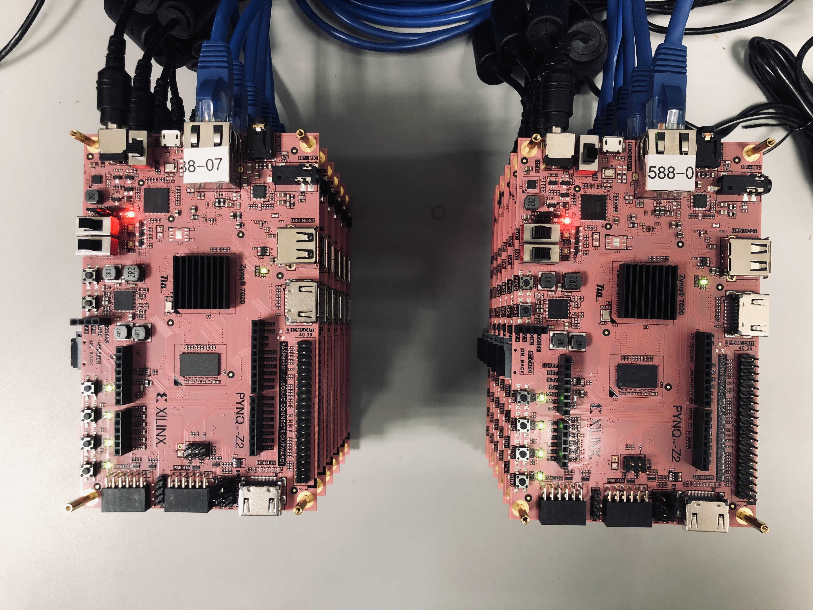

# ECE 588 - Hardware Acceleration for ML
--------------------------------------------------------------------------
This page was created to host for the course **ECE 588 - Hardware Acceleration for ML** taught by Prof. KYUWON KEN CHOI. 

Acknowledgments : Many thanks to the ECE Department for providing us with 12 PYNQ-Z2 FPGA boards, and special thanks to Dr. Yi, who helped in the whole setup of the baords.  

Below is two images of the 12 PYNQ-Z2 FPGA boards located in DA LAB (SH309).

## Lab Tutorials: 
--------------------------------------------------------------------------
[Tutorial I](./tut/)
