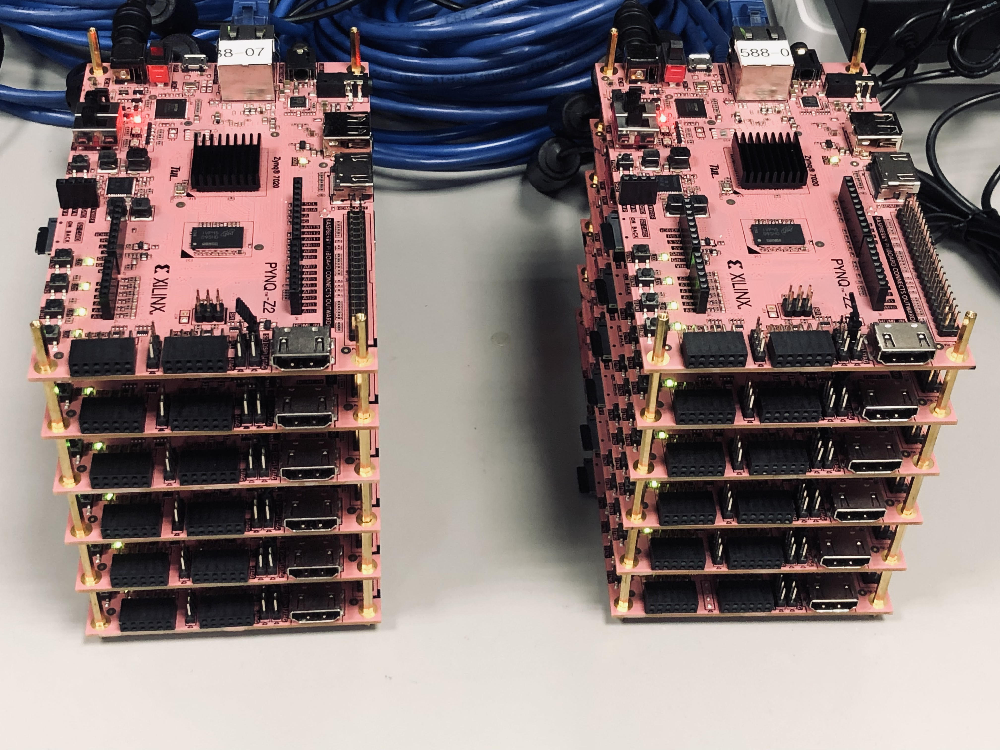

# ECE 588 - Hardware Acceleration for ML
--------------------------------------------------------------------------
**Purpose:** This page was created to host any related handouts/tutorials for the course **ECE 588 - Hardware Acceleration for ML** taught by [Prof. Kyuwon Ken Choi](http://www.ece.iit.edu/~vlsida/people.html) at Illinois Institute of Technology.

**Acknowledgments:** Many thanks to the ECE Department for providing us with 12 PYNQ-Z2 FPGA boards, and special thanks to Dr. Yi, who helped in this whole setup. 

Below is an image of the 12 PYNQ-Z2 FPGA boards located in DA LAB (SH309). 

## **Lab Descritptions & Tutorials**:
---
* Lab 1 : Evaluation of DNNs Performance on Different Hardware Platforms via the Roofline Plot _(FPGA, GPU, CPU, TPU, and SoC)_
  
* Lab 2 : Intro to HLS on FPGA with Implementation and Optimization of the KNN Machine Learning Classifier
  * Case Study I : Matrix Multiplication in the Convolution Layer

* Lab 3 : On-board FPGA Acceleration of the Convolution Layer in DNNs with Vitis→Vivado→PYNQ Framework Flow
  * Case Study II  : First Convolutional Layer in AlexNet  
  * [Tutorial I](./tut/) : On-board FPGA Acceleration of Case Study I (Unoptimized Matrix Multiplication)

* Lab 4 : Design Techniques to Accelerate the Convolutional Layer in DNNs on FPGA
  * Case study III : First Convolutional Layer in VGG-11
