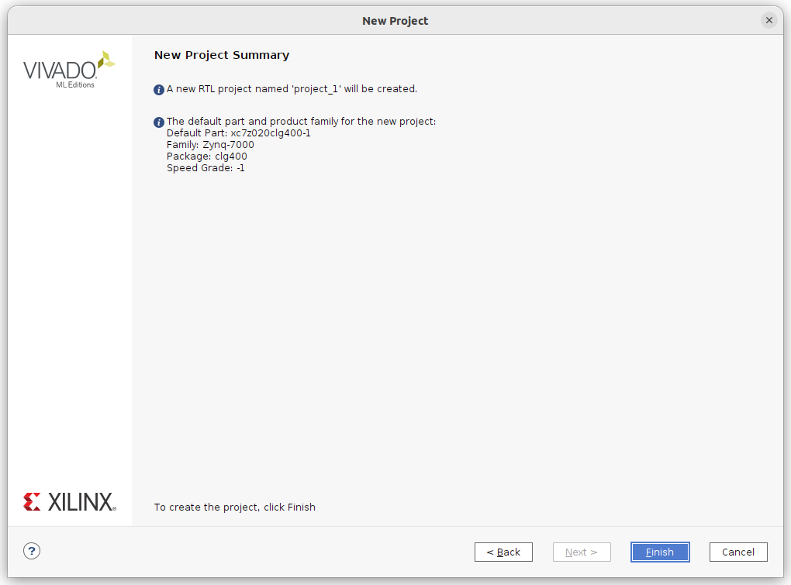
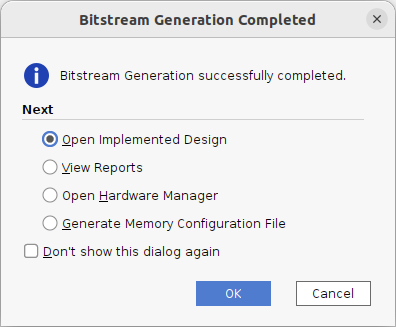
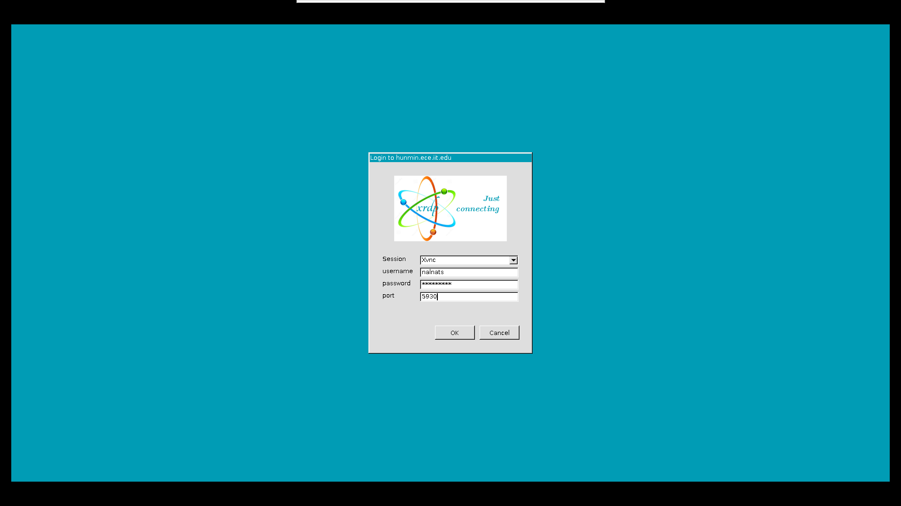
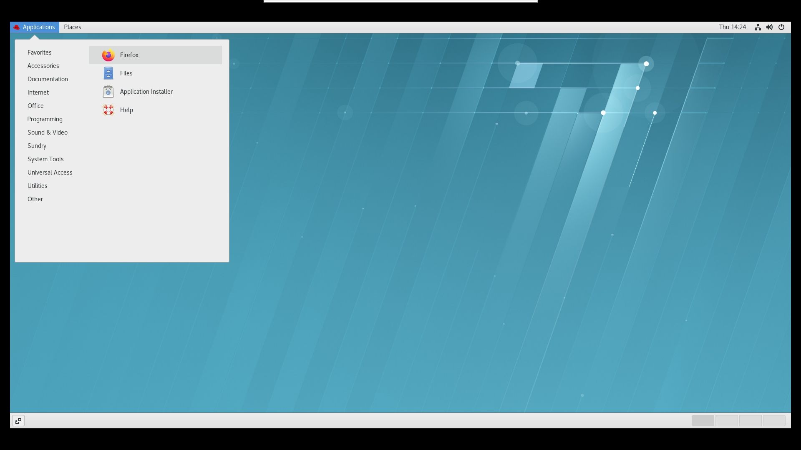

# Tutorial I: On-board Implementation of Case Study I (Matrix Multiplication): 

## Part 1 : 

```
make vitis
```

## Part 2 : Generate the bitstream (.bit) and hardware handoff (.hwh) files

1. Invoke Vivado by simply typing vivado in the terminal
```
vivado
```
Vivado Welcome widnow will pop-up 


2. Click on **Create Project** from the Quick Start menu, a new window will pop-up, click **Next**


3. Leave the **Project Name** as **project_1**, and the location under your lab3/part1 directory, and click **Next**


4. Click on **RTL Project** and select "Do not specify sources at this time", and click **Next**


5. From the search button type the part number : **xc7z020clg400-1**, and click **Next**


6. The new project summary should look like below, click **Finish**


7. From the **Project Manager** window, click on **IP Catalog**


8. Right click on **Vivado Repository** and choose **Add Repository**


9. Navigate and choose the directory **solution1**


10. You should see the HLS IP like the one below (the IP in ORANGE, however if you see it in GREY color, go back and check that you selected the correct part number), click on **OK**


11. From the **IP Navigator** window, click on **Create Block Design**


12. Leave the Design name as **design_1**  


13. From the Diagram window, click on **Add IP**


14. Type **hls** to choose your HLS IP (Matmul) that was generated from Part 1


15. You should see the matmul_0 HLS IP added like below : 


16. Click on **Add IP** again, and type **q7** to bring the ZYNQ7 processing system 


17. You should see the processing_system7_0 IP added like below : 


18. If you take a look at the **matmul.cpp** code, we initallly created the IP interfaces with two bundles, where one of the inputs has its own bundle **mem2**, and the other input share a bundle with the output **mem1**. The code below to refresh your memory : 
```
#pragma HLS interface mode = m_axi depth = 1 port = Matrix_A_DRAM offset = slave bundle = mem1
#pragma HLS interface mode = m_axi depth = 1 port = Matrix_B_DRAM offset = slave bundle = mem2
#pragma HLS interface mode = m_axi depth = 1 port = Matrix_C_DRAM offset = slave bundle = mem1
#pragma HLS interface mode = s_axilite port = return
```
Since, our HLS IP has two bundles, we need to create 2 AXI slave buses in the controller. Double click on the processing_system7_0 IP, and navigate to **PS-PL Configuration** → **HP Slave AXI interface** and select **AXI HP0 interface**, and **AXI HP1 interface**


19. Navigate to **Clock Configuration** → **PL Fabric Clocks** and change the **FCLK_CLK0** to **100MHz**


20. Click on **OK**, you should see the processing_system7_0 IP modification like below : 


21. To connect the PS and the PL, click on **Run Connection Automation**


22. We need to map the IP ports to the two AXI HP slave buses in the PS, select **S_AXI_HP0** with the Master interface of **m_axi_mem1**


23. Select **S_AXI_HP1** with the Master interface of **m_axi_mem2**


24. Click on **OK**, you should see the diagram like below : 


25. To validte our block design, click on **design_1** → **Validate Design**


26. You should see the Validation successful window like below:  


27. Now to create a HDL wrapper, click on **design_1** → **Create HDL Wrapper**


28. A new window will pop-up, select **Let Vivado manage wrapper and auto-update** click **OK**


29. To generate the bitstream, click on **Generate Bitstream** under **PROGRAM AND DEBUG** menu
The **No Implementation Results Avaialble** window will pop-up, click **Yes**


30. The below window will popup, click **OK**


31. Vivado tool will now run sythesis → implementation and then it will generate the **bitstream**, when the Bitstream Generation is Completed, you will see the below window. Click on **Open Implemented Design**  


32. You will see xx, along with the Design Timing Summary.


33. Navigate to the **Power**, and you should see the summary window like below :


34. Quit Vivado!

## Part 3 : Copy the bitstream and the hardware handoff to FPGA board
You should be under lab3/part1 directory, now we need to find the **.bit** and **.hwh** files and copy them to our PYNQ-Z2 Board

1. To find the hardware handoff, type the below command: 
```
$ find . -type f -name "*.hwh"
```
You should see the output as below  :
```
$ ./project_1/project_1.gen/sources_1/bd/design_1/hw_handoff/design_1.hwh
```

2. Copy the hardware handoff to your lab3/part1 directory by typing the command below  :
```
$ cp ./project_1/project_1.gen/sources_1/bd/design_1/hw_handoff/design_1.hwh .
```

3. To find the bitstream, type the below command: 
```
find . -type f -name "*.bit"
```
You should see the output as below  :
```
$ ./project_1/project_1.runs/impl_1/design_1_wrapper.bit
```

4. Copy the bitstream to your lab3/part1 directory by typing the command below  :
```
cp ./project_1/project_1.runs/impl_1/design_1_wrapper.bit .
```

5. The hardware handoff and the bitstream name needs to match, hence let's change them to **matmul.hwh**, and **matmul.bit**, type the below commands to do so  :
```
mv design_1.hwh matmul.hwh
mv design_1_wrapper.bit design_1.bit
```
**NOTE : I HAVE NO CLUE WHY VIVADO TOOL HAVE THIS REQUIRMENT, AND WHY THEY DON'T GENERATE BOTH FILES WITH THE SAME NAME AUTOMATICALLY!!!! GO FIGURE**

6. Now, we need to copy both files to the PYNQ-Z2 board , to do so type the follwoing command : 
```
scp -rP x588 matmul.hwh matmul.bit xilinx@216.47.144.102:/home/xilinx/
```
**NOTE : for you need to change x with your group number** for example, you are in group number 1, the below command will copy the files to PYNQ-Z2 board number 1. 
```
scp -rP 1588 matmul.hwh matmul.bit xilinx@216.47.144.102:/home/xilinx/
```

7. It will ask you for a password, the password is **xilinx** (yes all small letters, no spaces, no numbers, no special characters!) 
```
$ xilinx@216.47.144.102's password:
```





