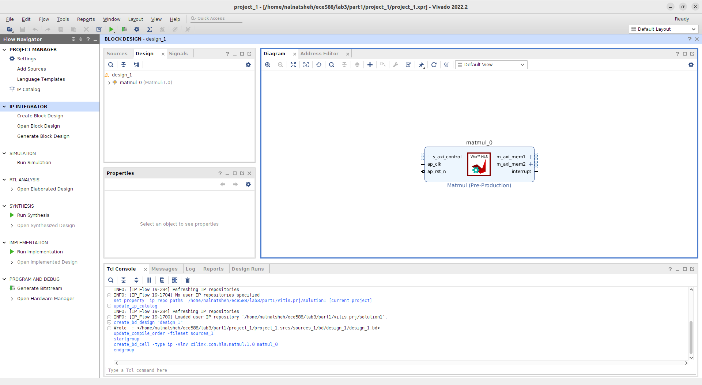
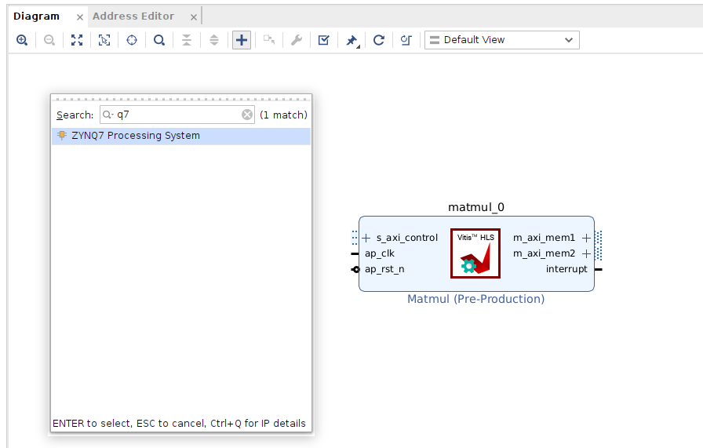

# Tutorial I: On-board FPGA Acceleration of Case Study I (Unoptimized Matrix Multiplication): 

## **Part 1 : Create the Matrix Multipliation IP via the VitisHLS Solution**
1. Under your lab3/part1 directory, type the below command : 

```
make ip
```
Vitis will run the flow of : simulation→synthesis→export_ip  
export_ip : exports and packages the generated RTL code as a packaged IP for use in the Vivado Design Suite. 

## **Part 2 : Generate the bitstream (.bit) and the hardware handoff (.hwh) files**

### A. Create a New Project
1. Invoke Vivado by simply typing vivado in the terminal
```
vivado
```
Vivado Welcome widnow will pop-up 

initiated

2. Click on **Create Project** from the Quick Start menu, a new window will pop-up, click **Next**


3. Leave the **Project Name** as **project_1**, and the location under your **lab3/part1** directory, and click **Next**


4. Click on **RTL Project** and select "Do not specify sources at this time", and click **Next**


5. From the search button type the part number : **xc7z020clg400-1** (This is the FPGA Device number of the PYNQ-Z2 board), and click **Next**


6. The new project summary should look like below, click **Finish**


### B. Add the HLS IP, and Create a Block Design
1. From the **Project Manager** window, click on **IP Catalog**


2. Right click on **Vivado Repository** and choose **Add Repository**


3. Navigate and choose the directory **solution1** (the one under lab3/part1/vitis.prj directory)


4. You should see the HLS IP like the one below (the IP in ORANGE, however if you see it in GREY color, go back and check that you selected the correct part number), click on **OK**


5. From the **IP Navigator** window, click on **Create Block Design**


6. Leave the Design name as **design_1**  


7. From the Diagram window, click on **Add IP**


8. Type **hls** to choose your HLS IP (Matmul) that was generated from Part 1

You should see the matmul_0 HLS IP added like below : 


9. Click on **Add IP** again, and type **q7** to bring the ZYNQ7 processing system 

You should see the processing_system7_0 IP added like below : 


10. If you take a look at the **matmul.cpp** code, we initallly created the IP interfaces with two bundles, where one of the inputs has its own bundle **mem2**, and the other input share a bundle with the output **mem1**. The code below to refresh your memory : 
```
#pragma HLS interface mode = m_axi depth = 1 port = Matrix_A_DRAM offset = slave bundle = mem1
#pragma HLS interface mode = m_axi depth = 1 port = Matrix_B_DRAM offset = slave bundle = mem2
#pragma HLS interface mode = m_axi depth = 1 port = Matrix_C_DRAM offset = slave bundle = mem1
#pragma HLS interface mode = s_axilite port = return
```
Since, our HLS IP has two bundles, we need to create 2 AXI slave buses in the controller. Double click on the processing_system7_0 IP, and navigate to **PS-PL Configuration** → **HP Slave AXI interface** and select **AXI HP0 interface**, and **AXI HP1 interface**


11. Navigate to **Clock Configuration** → **PL Fabric Clocks** and change the **FCLK_CLK0** to **100MHz**


12. Click on **OK**, you should see the processing_system7_0 IP modification like below : 


13. To connect the PS and the PL, click on **Run Connection Automation**


14. We need to map the IP ports to the two AXI HP slave buses in the PS, select **S_AXI_HP0** with the Master interface of **m_axi_mem1**


15. Select **S_AXI_HP1** with the Master interface of **m_axi_mem2**


16. Click on **OK**, you should see the diagram like below : 


17. To validte our block design, click on **design_1** → **Validate Design**


18. You should see the Validation successful window like below:  


### C. Create a HDL Wrapper and generate the bitstream
1. Now to create a HDL wrapper, navigate to Sources, and under design sources, right click on **design_1** → **Create HDL Wrapper**


2. A new window will pop-up, select **Let Vivado manage wrapper and auto-update** click **OK**


3. To generate the bitstream, click on **Generate Bitstream** under **PROGRAM AND DEBUG** menu
The **No Implementation Results Avaialble** window will pop-up, click **Yes**


4. The below window will popup, click **OK**


5. Vivado tool will now run sythesis → implementation → and then it will generate the **bitstream**, when the Bitstream Generation is Completed, you will see the below window. Click on **Open Implemented Design**  


6. You will see the implemented design. Vivado IDE opens the implemented netlist and applies the physical and timing constraints used during implementation, placement, and routing results against the implemented part, along with the Design **Timing Summary**.


7. Navigate to the **Power**, and you should see the summary window like below :


8. Quit Vivado!

## **Part 3 : Copy the bitstream and the hardware handoff to FPGA board**
You should be under lab3/part1 directory, now we need to find the **.bit** and **.hwh** files and copy them to our PYNQ-Z2 Board

1. To find the hardware handoff, type the below command: 
```
$ find . -type f -name "*.hwh"
```
You should see the output as below  :
```
$ ./project_1/project_1.gen/sources_1/bd/design_1/hw_handoff/design_1.hwh
```
Copy the hardware handoff to your lab3/part1 directory by typing the command below  :
```
$ cp ./project_1/project_1.gen/sources_1/bd/design_1/hw_handoff/design_1.hwh .
```

2. To find the bitstream, type the below command: 
```
find . -type f -name "*.bit"
```
You should see the output as below  :
```
$ ./project_1/project_1.runs/impl_1/design_1_wrapper.bit
```
Copy the bitstream to your lab3/part1 directory by typing the command below  :
```
cp ./project_1/project_1.runs/impl_1/design_1_wrapper.bit .
```

3. Xilinx have a requirment that the hardware handoff and the bitstream files names needs to match to run on the FPGA board, hence let's change them to **matmul.hwh**, and **matmul.bit** respectively, to do so  type the below commands seperatley  :
```
mv design_1.hwh matmul.hwh
mv design_1_wrapper.bit matmul.bit
```
**NOTE : I HAVE NO CLUE WHY VIVADO TOOL HAVE THIS REQUIRMENT, AND WHY THEY DON'T GENERATE BOTH FILES WITH THE SAME NAME AUTOMATICALLY!!!! GO FIGURE**

4. Now, we need to copy both files to the PYNQ-Z2 board, to do so type the follwoing command : 
```
scp -rP x588 matmul.hwh matmul.bit xilinx@216.47.144.102:/home/xilinx/
```
**NOTE : You need to change x with your group number** for example, you are in group number 1, the below command will copy the files to PYNQ-Z2 board number 1. 
```
scp -rP 1588 matmul.hwh matmul.bit xilinx@216.47.144.102:/home/xilinx/
```
**EACH GROUP HAVE A UNIQUE PORT NUMBER, ONLY COPY AND ACCESS THE PYNQ-Z2 BOARD THAT WAS ASSIGNED TO YOU ACCORDING TO THE EXCEL SHEET**
5. It will ask you for a password, the password is **xilinx** (yes all small letters, no spaces, no numbers, no special characters!) 
```
$ xilinx@216.47.144.102's password:
```

## **Part 4 : Accelearte the HLS IP on PYNQ-Z2 board**
A. Acces Jupyter Notebook and upload matmul.ipynb notebook : 

1. Login to your account on Hunmin server, at this point I will trust that you know how to get to the below image and login to your account! (Establish a vncserver connection, and type your password and the generated port number). If you absolutely have no clue, navigate to this [site](http://www.ece.iit.edu/ecesysdocs/) .


2. Invoke the web browser **Firefox**, click on **Applications** → **Firefox**


3. Navigate to **216.47.144.102:588xx**  
**NOTE : you need to change xx with your group number** for example, you are in group number 1, the below address will access PYNQ-Z2 board number 1.
```
216.47.144.102:58801
```


4. You should see Jupyter Notebook Homepage like below, the password is **xilinx** (yes all small letters, no spaces, no numbers, no special characters!) 


5. Once you login, you need to upload the notebook **matmul.ipynb** provided to you. Click on upload and find your notebook file under lab3/part1 directory


6. Double click on **mamtmul.ipynb** notebook to open it


B. Understanding the matmul.ipynb notebook  
This notebook will perform the matrix multiplication on the Pynq-Z2 FPGA, overlay a hardware design, and compare the performance of the matrix multiplication between the FPGA's Programmable Logic (PL) and the Processing System (PS). Here's an explanation of each part of the code:

1. **Importing required libraries**
```
import pynq
import time
import numpy as np
```
pynq: this is the PYNQ library, which enables interaction between the host (ARM processor) and the programmable logic (PL)  
time: used for measuring the execution time of the operations  
numpy: provides support for large, multi-dimensional arrays and matrices, as well as mathematical functions to operate on these arrays  

2. **Overlaying the Bitstream**
```
bitstream = "/home/xilinx/matmul.bit"
overlay = pynq.Overlay(bitstream)
```
**bitstream** : this file contains the hardware configuration for the targeted FPGA  
**pynq.overlay** : loads the bitstream onto the FPGA Programmable Logic (PL) and configers the hardware  
You can learn more about overlays from this [site](https://pynq.readthedocs.io/en/v3.0.0/overlay_design_methodology/overlay_tutorial.html)  
To display details about the overlay.
```
overlay?
```

3. **Accessing the top-level design and checking the details**
```
dut = overlay.matmul_0
dut?
```
dut: the Device Under Test, this variable points to the specific hardware block **matmul_0**  
dut?: used to display information about the hardware block

4. **Creating Buffers for I/O**
```
A = pynq.allocate((100, 150), dtype='int16')
B = pynq.allocate((150, 200), dtype='int16')
C = pynq.allocate((100, 200), dtype='int16')
```
**pynq.allocate** : Allocates memory on both the host (CPU) and device (FPGA) to transfer data between them.

5. **Initialising Input Arrays with Random Values:**
```
np.random.seed(0)
A[:] = np.random.randint(0, 100, size=(100, 150), dtype=np.int16)
B[:] = np.random.randint(0, 100, size=(150, 200), dtype=np.int16)
```
the random seed is set for reproducibility  
Matrices A and B are initiated with random integers between 0 and 255  

6. **Syncing Data to the FPGA**
```
A.sync_to_device()
B.sync_to_device()
```
The sync_to_device() ensures that the data in the matrices is copied from the host's (PS) memory to the PL memory

7. **Setting Hardware Registers**
```
dut.register_map.Matrix_A_DRAM_1 = A.device_address & 0xFFFFFFFF
dut.register_map.Matrix_A_DRAM_2 = A.device_address >> 32
```
this code sets up the addresses for matrix A in the FPGA memory. The matrix address are split into two parts (lower and upper 32 bits), why? because the FPGA uses a 64-bit addressing scheme   
**dut.register_map** refers to the memory-mapped registers in the FPGA that control the operation of the matrix multiplication accelerator  

8. **Accelerating on FPGA**
```
start_time = time.time()
dut.register_map.CTRL.AP_START = 1
dut.register_map.CTRL[4] = 1
while not dut.register_map.CTRL.AP_DONE: pass
end_time = time.time()
duration = end_time - start_time
print(f'Kernel completed in {duration * 1000:.2f}ms')
```

The accelerator is started by setting **CTRL.AP_START** to 1, which will start the matrix multiplication on the FPGA, after that a loop is initiated so the FPGA to signal that the operation is complete by checking the **CTRL.AP_DONE** flag  

The results below is for an **Optimized Matrix Multipliucation IP on PL**. For the unoptimized HLS IP, you should see a number around ~55ms! 


9. **Verifying the Results**
```
C.sync_from_device()
C_cpu = np.matmul(A, B)

if np.allclose(C, C_cpu, atol=1e-5):
    print("FPGA output matches CPU output! Verification successful.")
else:
    print("FPGA output does not match CPU output. Verification failed.")
```
After the computation is done, **sync_from_device()** fetches the results of matrix C from the FPGA memory back to the PS memory. The **np.matmul()** function is used to perform matrix multiplication on the CPU for comparison. **np.allclose()** checks if the result from the FPGA (C) is approximately equal to the result computed by the CPU (C_cpu) within a tolerance (atol=1e-5).

10. Freeing the Overlay
```
overlay.free()
```
This frees the FPGA resources, releasing the overlay and any associated memory buffers.

11. Peform Matrix Multiplication on the PS
```
start_time = time.time()
c_host = np.matmul(A, B)
end_time = time.time()
duration = end_time - start_time
print(f'PS computation completed in {duration * 1000:.2f}ms')
```
The results below is for a **Optimized Matrix Multipliucation IP on PS**


**Conclusion : by comparing the results we got from running HLS IP on PL vs PS (2.31ms vs 268.55) we achieved x100 better results! RemEmber that the CPU in the PS runs on a clock frequency of GHz unit compred to the PL that runs on 100MHz, so baically slower clock rate and we still beat the CPU!
Crazy? Yup, this is the Power of custoimized designs and FPGA**

12. Close and Halt the Notebook  


